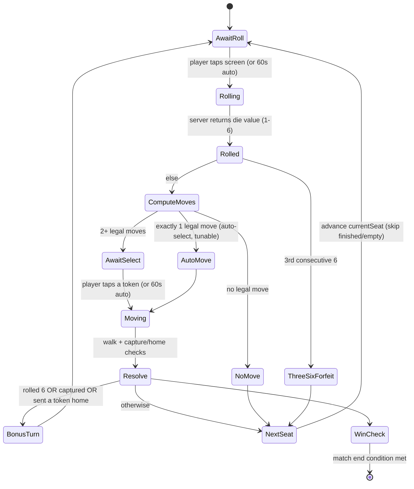
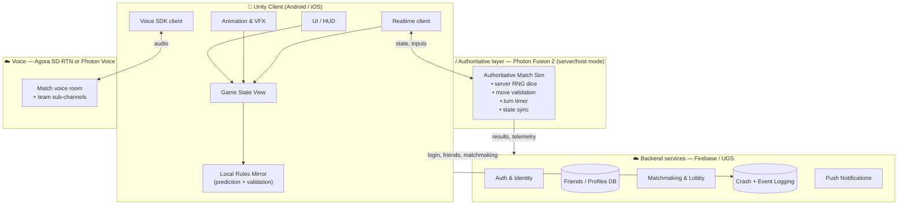

# Ludo Royale — Game Design & Technical Requirements

> **Status:** DRAFT for review · **Owner:** premk · **Last updated:** 2026-06-26
> **Product name (from design):** **Ludo Royale** — "Premium pastel direction · 10-screen flow · live voice & emotes · iOS & Android · portrait, all-ages."
> **Purpose:** Single source of truth for the online multiplayer Ludo game (Android + iOS).
> **Design source:** The Claude Design export (`Ludo Game Flow.dc.html` + screenshots + character art) is imported under [`design/`](../design/). This document is reconciled against it — see [§14](#14-ui--ux-screen-flow--design-system).
> This document is written to be *verified first, implemented second*. Nothing here is built yet.

---

## 0. How to read this document

| If you want… | Go to |
|---|---|
| The decisions we already locked | [§1 Locked decisions](#1-locked-decisions-from-your-answers) |
| What the product actually is | [§2 Product vision & scope](#2-product-vision--scope) |
| **Every game rule, in detail** (incl. 6/8/10-player boards) | [§4 Game rules & logic engine](#4-game-rules--logic-engine-the-spec) |
| The tech stack & why | [§5 Technical architecture](#5-technical-architecture) |
| Voice chat design | [§7 Voice & audio](#7-voice--audio) |
| Animations (dice, stickman walk/kick) | [§8 Animation & VFX spec](#8-animation--vfx-specification) |
| Notifications, timeouts, reconnect | [§9 Notifications, resilience & auto-play](#9-notifications-resilience--auto-play) |
| Database / backend schema | [§11 Data model & backend](#11-data-model--backend) |
| What it costs | [§13 Third-party services & cost](#13-third-party-services--indicative-cost) |
| The build plan | [§15 Engineering roadmap](#15-engineering-roadmap--milestones) |
| **What I still need you to confirm** | [§17 Open questions](#17-open-questions-need-your-decision) |

---

## 1. Locked decisions (from your answers)

These are confirmed and drive everything below:

| # | Decision | Choice | Consequence |
|---|---|---|---|
| 1 | **Business model** | **Free for all. No ads. No real-money.** | No payment gateway, no KYC, no gambling-law exposure, no ad SDK. Simpler legal + store review. We still log auth, crashes, and friends in a backend DB. |
| 2 | **Client engine** | **Unity (6.3 LTS recommended)** | C# game code; Unity for rendering, animation, physics dice, particles. Mature mobile + voice/netcode SDK ecosystem. |
| 3 | **Board model** | **Extended 6 / 8 / 10-player boards** | Each player gets their **own** colour & home column. Teams = 2v2 / 3v3 / 4v4 / 5v5. Requires custom hexagonal (6), octagonal (8) and decagonal (10) board art + a *parametric* path engine (see §4.3). |
| 4 | **Launch scope** | **Full feature set before launch** | First public release includes 2–10 players, all team modes, voice chat, full animation set, and all notifications. We still build in milestones internally (§15) — "full scope" changes *what ships*, not whether we sequence the work. |

> ⚠️ **Reality check on "full feature set before launch":** building everything (up-to-10-player netcode + extended boards + voice + full skeletal animation + reconnection) before *any* release is a large first milestone (realistically multi-month for a small team). I've kept the roadmap in §15 so we ship in a sensible internal order even though the *public* launch waits for the whole set. If timeline pressure appears, the fallback is "MVP = 2–4 player classic board" and that path is already laid out. Flagged as an open question in §17.

---

## 2. Product vision & scope

**One-liner:** A polished, real-time, online multiplayer Ludo for mobile where 2–10 friends play classic or team Ludo together, talk over live voice chat, and enjoy console-grade dice/character animations — with rock-solid handling of drops, lag, and idle players.

### 2.1 In scope (v1, full set)
**Core gameplay**
- Online multiplayer, **2–10 players**.
- **Game modes (from design):** Quick Match, Classic (4-player ranked), Quick (2-token fast), Private Room (invite/code), **Team Up** — plus your extended **Team** modes (2v2, 3v3, 4v4, 5v5) and **FFA**.
- **Boards:** Classic 4-seat (2/3/4 players), Hexagonal 6-seat (5/6), Octagonal 8-seat (7/8), Decagonal 10-seat (9/10). *(Design art currently covers the 4-seat board + 2v2; 6/8/10-seat art is a known gap — §14.4.)*
- **Tap-to-roll** dice with high-end animated VFX (design keyframe `diceTumble`).
- **Personalised stick-legged character tokens** (your "Prem Character" style) with realistic walk + "kick-off" (capture) animations — design keyframes already defined (§8.3).
- **Live voice chat** (per-match Voice Room, team channels), per-player **mic toggle / mute / opt-out**, plus **emotes** (both confirmed in design).
- Full **notification & resilience** layer (connectivity, exits, lag, 60s timeout, auto-play, reconnect — design `toastIn`).
- Bots (AI) for empty seats, single-player practice, and idle/disconnected takeover.
- SFX, background music, haptics.

**Meta / social (all present in the design — now in scope)**
- **Accounts & onboarding** (Apple / Google / Guest), **Profile · Stats** (win rate, history).
- **Friends · Social hub** (list, presence, add/invite, join friend).
- **Store · Cosmetics** — **free, earned only** (token skins, dice skins, board themes). No purchases.
- **Soft currencies** — **coins + gems**, *earned* via play/rewards (never bought, per "no real-money").
- **Daily Rewards** (streaks), **Leaderboards · Tournaments** (e.g., "Weekend Cup", "climb the ranks" / ranked play).
- **Backend logging** of auth events, crashes, sessions.

**Platform styling**
- iOS (pastel) + **Android (Material)** variants — both in the design.

### 2.2 Out of scope (v1)
- Ads, in-app purchases, **paid** currency, real-money / wagering, wallets, KYC. *(Coins/gems exist but are earned-only.)*
- Web/desktop clients (mobile only; engine choice keeps the door open later).
- Cross-game social network / global chat rooms beyond match + friends.

### 2.3 Target users & platforms
- **Platforms:** Android 8.0+ (API 26+) and iOS 13+. Phone-first, tablet-friendly.
- **Devices:** Must run smoothly on low/mid-range Android (2–3 GB RAM). This constrains the art/VFX budget (§8.7, §12).
- **Network:** Must feel responsive on 3G/4G/patchy Wi-Fi with 150–300 ms RTT and brief dropouts.

---

## 3. Functional requirements (traceability)

Mapping **your 10 requirements** → where they're addressed, so nothing is dropped.

| Your req | Summary | Addressed in |
|---|---|---|
| 1 | Online multiplayer | §5 Architecture, §6 Netcode |
| 2 | Low network latency / no disturbance | §6.4 Latency strategy, §9 Resilience |
| 3 | Stunning animated effects | §8 Animation & VFX |
| 4 | 2–10 players, individual or team (2x2/3x3/4x4/5x5) | §4 Rules, §4.3 Boards, §4.8 Teams |
| 5 | In-game voice chat, with opt-out per person | §7 Voice & audio |
| 6 | High tech + animation standard, no disturbance | §8 + §12 Performance budgets |
| 7 | Notifications (connectivity, exit, lag, timeout, auto-play) | §9 Notifications & resilience |
| 8 | Single tap rolls dice with stunning visuals | §4.5 Turn flow, §8.2 Dice |
| 9 | Realistic stickman walk + kick-off animation | §8.3 Character animation |
| 10 | All required game logic | §4 (entire section) |

**Additional requirements I recommend adding** (gaps you asked me to find — see §17 for confirmation):

| New | Why it matters |
|---|---|
| **Server-authoritative dice & moves** | Even free games get cheated (memory editors, modded APKs). The server must roll the dice and validate every move, or one cheater ruins matches for everyone. |
| **Reconnection & match resume** | Mobile networks drop constantly. Without resume, every drop = a ruined game. |
| **Bot/AI fill + takeover** | Needed for the 60s auto-play requirement, disconnects, and to start matches without a full lobby. |
| **Account system + friends graph** | Implied by "connect with friends." Needs login, identity, friend invites, presence. |
| **Spectator / "watch friends" mode** | Common in social Ludo; cheap once state-sync exists. *(optional)* |
| **Anti-grief / report + mute** | Voice chat with strangers needs per-user mute and a report path (store-policy requirement on both Apple & Google). |
| **Accessibility & localization** | Colour-blind-safe palettes (Ludo is literally colour-coded!), text scaling, and at least English + Hindi to start. |
| **Push notifications** | "Your turn," "friend invited you," re-engagement. |
| **Age gating / privacy consent** | Voice + accounts + minors ⇒ COPPA/GDPR-K and store age ratings. |

---

## 4. Game rules & logic engine (the spec)

This section is the authoritative rules definition. It is written so the **rules engine can be implemented and unit-tested directly from it**, independent of graphics or networking. All tunables live in a single `GameConfig` (§4.11).

### 4.1 Entities

```
Match
 ├─ id, mode (FFA | TEAM), boardType (CLASSIC4 | HEX6 | OCT8 | DEC10)
 ├─ seats[N]            // N ∈ {2,3,4,6,8,10}; each seat = one player or bot
 ├─ teams[]             // only in TEAM mode
 ├─ turnOrder[]         // seat indices, clockwise
 ├─ currentSeat, currentRoll, rollCount (consecutive sixes)
 ├─ rngSeed / rngState  // server-side, audited
 └─ status (LOBBY | STARTING | IN_PROGRESS | PAUSED | FINISHED | ABANDONED)

Seat
 ├─ player (userId | botProfile), colour
 ├─ tokens[4]           // each Ludo seat has 4 tokens
 ├─ connection (ONLINE | LAGGING | RECONNECTING | DISCONNECTED | BOT)
 └─ finishedRank (null | 1..N)

Token
 ├─ id, state (IN_BASE | ON_TRACK | IN_HOME_COLUMN | HOME)
 ├─ progress   // 0..(PATH_LEN-1), token's own relative path index
 └─ cell       // resolved board cell for rendering
```

### 4.2 The board, conceptually

A Ludo board is a **shared ring** of cells that all tokens travel clockwise, plus a **private home column** per seat that branches off the ring and leads to the centre. Every seat has:
- a **START cell** on the ring (where a token enters from base),
- a **HOME-ENTRY cell** on the ring (where its tokens leave the ring and turn into the home column),
- a **6-cell home column** ending in the centre **HOME** triangle.

We model **all** board sizes with one parametric definition so the rules engine never special-cases 4 vs 6 vs 8.

### 4.3 Parametric board geometry (4 / 6 / 8 seats)

Let **N** = number of seats. We use the same per-arm spacing as classic Ludo (13 ring cells per arm) so each board is a clean generalisation of the familiar one.

| Symbol | Definition | N=4 (Classic) | N=6 (Hex) | N=8 (Oct) | N=10 (Decagon) |
|---|---|---|---|---|---|
| `RING = 13 × N` | shared ring length | **52** | **78** | **104** | **130** |
| `START_i = 13 × i` | seat *i* start cell | 0,13,26,39 | 0,13,…,65 | 0,13,…,91 | 0,13,…,117 |
| `HOME_ENTRY_OFFSET` | ring cells travelled before turning into home (tunable) | **50** | 50 | 50 | 50 |
| `HOME_ENTRY_i = (START_i + 50) mod RING` | divert cell | 50,11,24,37 | … | … | … |
| `HOME_COLUMN_LEN` | private cells incl. centre | **6** | 6 | 6 | 6 |
| `PATH_LEN = 51 + 6 = 57` | token positions (rel 0…56) | **57** | 57 | 57 | 57 |
| **Steps start→home** | `PATH_LEN − 1` | **56** | 56 | 56 | 56 |
| `SAFE cells` | `START_i` and `(START_i + 8) mod RING`, ∀ i | 8 cells | 12 cells | 16 cells | 20 cells |

> **Key design choice — constant journey length.** By fixing `HOME_ENTRY_OFFSET = 50`, **every player travels the same 56 steps to finish, regardless of board size.** For N=4 this reproduces *exactly* the classic board. For N=6/8/10 it keeps match length snug (a proportional board would make a 10-player game ~2.3× longer — 134 steps — and drag). The bigger ring with the same journey means tokens **share more of the ring → more captures, more interaction, more fun.** `HOME_ENTRY_OFFSET` is a `GameConfig` value designers can raise for deliberately longer "epic" matches.

**Player counts vs boards:** the engine is fully parametric (any N), but we ship dedicated art for **even** seat boards and seat odd counts on the next-larger board with an empty seat:
- **2, 3, 4 players →** `CLASSIC4` board (52-ring). Unused seats stay empty. 2-player default seats opposite; 3-player uses 3 of 4.
- **5, 6 players →** `HEX6` board (78-ring), hexagonal art, 6 home columns (5 = one seat empty).
- **7, 8 players →** `OCT8` board (104-ring), octagonal art, 8 home columns (7 = one seat empty).
- **9, 10 players →** `DEC10` board (130-ring), decagonal art, 10 home columns (9 = one seat empty).

A token's absolute board cell is resolved from its relative `progress`:
```
if progress <= 50:  cell = ringCell( (START_i + progress) mod RING )   // on shared ring
else:               cell = homeColumnCell( seat=i, depth = progress-51 ) // 0..5, 5 = centre HOME
```

### 4.4 Setup
- Each seat has **4 tokens**, all `IN_BASE`.
- `turnOrder` = seats clockwise from a randomly chosen starter (or host-first; tunable).
- Server initialises an **audited RNG** (`rngSeed` stored for dispute/debug).

### 4.5 Turn flow (state machine)



**Turn in words:**
1. It is `currentSeat`'s turn. A **single tap anywhere** (req #8) triggers the dice roll. (Server is the source of truth for the value; client plays the roll animation immediately and reveals the server value on arrival — see §6.4 + §8.2.)
2. Compute legal moves for the rolled value (§4.6).
3. 0 moves → pass. 1 move → auto-move (tunable; can require tap). 2+ → player taps the token to move (req #8 single-touch).
4. Resolve movement: walk animation, captures (§4.7), reaching home.
5. **Bonus turn** if the player rolled a 6, captured an opponent, or sent a token home — otherwise pass to next seat.
6. Check win conditions (§4.9).

### 4.6 Movement & legal-move rules
- **Leaving base:** a token may leave base only on a **6** (tunable `UNLOCK_ROLL=[6]`; some variants add 1). It enters on `START_i` (`progress=0`).
- **On track / home column:** token advances `progress += die`.
- **Exact finish:** to land on `HOME` (`progress=56`) the die must be exact. **Overshoot is illegal** — that token simply has no legal move for that value.
- **A move is legal iff** it doesn't overshoot home and doesn't land on a **blocked** cell (§4.7 blocks).
- **No legal move** for any token → turn passes (unless it was a 6 granting another roll first, depending on tunable).
- **Auto-move:** if exactly one legal move exists, engine may auto-apply it (`AUTO_MOVE_SINGLE=true`).

### 4.7 Capturing ("kick-off"), safe cells, blocks
- **Capture:** landing a token on a ring cell occupied by **exactly one opponent token** sends that opponent token back to `IN_BASE` ("kick-off" — drives the §8.3 kick animation). Capturer gets a **bonus turn**.
- **Safe cells:** the `SAFE` set (each `START_i` and its `+8` star cell). **No captures on safe cells.** Multiple tokens (even opponents) coexist there.
- **Blocks (a.k.a. walls/blockades):** two tokens of the **same seat** on the same non-safe cell form a **block**. Opponent tokens **cannot pass or land on** a block (tunable `BLOCKS_ENABLED=true`, `BLOCK_BLOCKS_PASSAGE=true`). Some rule sets only block landing, not passage — exposed as a tunable.
- **Team nuance:** teammates never capture each other; teammate tokens may share cells. Whether two *different teammates'* tokens form a block is `TEAM_BLOCKS=false` by default (keeps it simple) — confirm in §17.

### 4.8 Team mode (2v2 / 3v3 / 4v4 / 5v5)
- **Composition:** 2 teams. 2v2 on CLASSIC4, 3v3 on HEX6, 4v4 on OCT8, 5v5 on DEC10.
- **Seating:** teammates are **interleaved** around the board (A,B,A,B…) so one team can't wall off a whole region.
- **Captures:** cannot capture teammates.
- **Finishing & shared rolls (tunable `TEAM_SHARED_TURNS`):** when a player has all 4 tokens HOME, on their turn they may **roll for a teammate** who still has tokens in play (keeps finished players engaged and speeds endgame). Default **on**.
- **Win:** a team wins when **all tokens of all its members** are HOME. Team ranking by finish order.

### 4.9 Win / end conditions
- **FFA:** players are ranked 1st, 2nd, … by the order they get all 4 tokens HOME. Match ends when only one player remains unranked (they're last), or all finish. (Tunable: end at 1st winner vs play out full ranking — default play out for placement.)
- **TEAM:** first team to bring all members' tokens HOME wins; continue for 2nd place if desired.
- **Abandonment:** if all human players of a side leave and bots are disabled, match is voided/recorded as abandoned.

### 4.10 Dice & fairness
- **RNG lives on the server.** Uniform 1–6, cryptographically seeded per match, state persisted for audit.
- **Anti-frustration (tunable, default OFF for "pure" Ludo):** optional pity timer that nudges a 6 if a player has been stuck in base for many turns. Off by default; flagged because many casual Ludo apps quietly use it — your call (§17).
- **Three-sixes rule:** three consecutive 6s → **turn forfeited**, and per common rule the pending advance from the third six is **cancelled** (`THREE_SIX_CANCELS=true`).

### 4.11 `GameConfig` (all tunables in one place)

| Key | Default | Meaning |
|---|---|---|
| `UNLOCK_ROLL` | `[6]` | rolls that free a token from base |
| `HOME_ENTRY_OFFSET` | `50` | ring cells before home turn (sets journey length) |
| `HOME_COLUMN_LEN` | `6` | private home cells incl. centre |
| `EXACT_FINISH` | `true` | must land exactly on home |
| `BONUS_ON_SIX` / `BONUS_ON_CAPTURE` / `BONUS_ON_HOME` | `true` | extra-turn triggers |
| `THREE_SIX_CANCELS` | `true` | 3rd six voids the move + turn |
| `BLOCKS_ENABLED` / `BLOCK_BLOCKS_PASSAGE` | `true`/`true` | blockade rules |
| `TEAM_SHARED_TURNS` | `true` | finished players roll for teammates |
| `TEAM_BLOCKS` | `false` | teammates can co-form a block |
| `AUTO_MOVE_SINGLE` | `true` | auto-apply the only legal move |
| `TURN_TIMEOUT_SEC` | `60` | idle timeout before auto-play |
| `TURN_WARN_SEC` | `10` | countdown warning threshold |
| `PITY_SIX_ENABLED` | `false` | anti-frustration nudge |

### 4.12 Auto-play AI (heuristic, also used for bots)
Decision priority when the timer fires or a bot acts (tunable weights):
1. **Win a token** (land exactly on HOME).
2. **Capture** an opponent (prefer capturing the most-advanced opponent token).
3. **Escape danger** (move a token that is within 1–6 of an enemy on a non-safe cell).
4. **Unlock** a token from base on a 6 (especially if board presence is low).
5. **Advance** the token closest to home / onto a safe cell.
6. Else move the least-risky legal token.

Difficulty tiers (Easy/Med/Hard) scale how many of these priorities the bot evaluates and whether it looks 1 ply ahead. Auto-play-for-idle-human uses **Medium**.

---

## 5. Technical architecture

### 5.1 High-level



### 5.2 Why this shape
Ludo is **turn-based**, so we do **not** need 60 Hz dedicated game servers per match. We need:
- **One authoritative referee** per match for **fair dice + move validation + the turn timer** (anti-cheat, even though the game is free).
- A **low-latency relay** so 2–10 players see each other's moves instantly.
- A **stateful match** that survives a player dropping and lets them **resume**.
- A **separate backend** for the slow-changing social/account/logging data.

This separation (fast realtime vs. slow backend) is standard and lets each scale independently.

### 5.3 Client architecture (Unity)
- **Layered:** `Presentation (UI/Anim/VFX/Audio)` ↔ `Game View-Model` ↔ `Net Client` ↔ `Authoritative match`. Rendering never mutates authoritative state directly.
- **Deterministic rules core** (`Ludo.Core`, pure C#, no UnityEngine references): board geometry, legal-move generation, capture/win resolution, AI. **Runs on both server (authority) and client (prediction/validation) and is 100% unit-testable** without Unity. This is the heart of the game and the first thing we build + test.
- **Rendering/animation layer** subscribes to state diffs and plays animations; it can start *cosmetic* animation optimistically (dice tumbling) before the authoritative result lands.
- **Asset strategy:** Addressables for boards/skins to keep base install small; 2D skeletal rigs (Spine/DragonBones) for the stickman (§8.3).

### 5.4 Tech stack summary

| Layer | Choice (recommended) | Alternative | Notes |
|---|---|---|---|
| Engine | **Unity 6.3 LTS** | — | LTS supported to Dec 2027; best mobile + ecosystem |
| Language | **C#** | — | |
| Rules core | **Custom `Ludo.Core` (pure C#)** | — | engine-agnostic, unit-tested |
| Realtime / authority | **Photon Fusion 2 (Server/Host mode)** | Nakama (self-host authoritative) · Colyseus | turn-based-friendly, Unity-native, up to 10 players per room easily |
| Backend (auth/friends/MM/logging) | **Firebase** (Auth, Firestore, Cloud Functions, Crashlytics, FCM) | Unity Gaming Services · PlayFab · Nakama | generous free tier, great mobile SDKs |
| Voice | **Agora Voice SDK** (rooms + team channels) | **Photon Voice** (tighter Fusion integration) · 100ms | clear free tier, sub-second latency |
| Crash/diagnostics | **Firebase Crashlytics** (+ optional Sentry) | Unity Cloud Diagnostics · Backtrace | free, Unity-supported |
| Analytics | **Firebase Analytics** / GameAnalytics | UGS Analytics | free tiers |
| 2D character rig | **Spine** or **DragonBones** | Unity 2D IK | skeletal stickman |
| Tweening/FX | **DOTween** + Unity VFX Graph/Shuriken | — | dice, captures, transitions |
| Push | **FCM** (+ APNs) | OneSignal | turn/turn & invites |

> **One-vendor option:** If you'd rather minimise vendors, **Nakama** can cover auth + friends + matchmaking + authoritative match loop + chat in one self-hosted server, and **Photon Voice** can ride on Photon for audio. Trade-off: Nakama means you run/operate Postgres + the Nakama server. For a small/indie team I lead with **Photon Fusion + Firebase + Agora** (lowest ops). See §17.

---

## 6. Networking & netcode

### 6.1 Model
- **Authoritative match** (Photon Fusion in **Server or Host** mode). The authority:
  - holds the canonical `Match` state,
  - **rolls the dice** (server RNG),
  - **validates** every move against `Ludo.Core`,
  - runs the **turn timer** and triggers auto-play,
  - broadcasts **state deltas** to all seats + spectators.
- **Clients send intents** ("I tap to roll", "I move token #2"), never authoritative results. A tampered client can request an illegal move; the authority rejects it.

### 6.2 Message protocol (illustrative)

| Direction | Message | Payload |
|---|---|---|
| C→S | `RollRequest` | matchId, seat |
| S→C | `RollResult` | seat, value(1–6), legalMoves[] |
| C→S | `MoveRequest` | matchId, seat, tokenId |
| S→C | `MoveApplied` | tokenId, fromProgress, toProgress, captures[], bonus:bool |
| S→C | `TurnChanged` | nextSeat, deadlineTs |
| S→C | `StateSync` | full snapshot (on join/reconnect) |
| S→C | `SeatStatus` | seat, connection(ONLINE/LAGGING/…) |
| S→C | `MatchEnded` | rankings[] |

State is small (tokens × seats), so **full-snapshot resync on reconnect** is cheap and robust.

### 6.3 Reconnection & resume
- Authority keeps the match alive through a **grace window** (`RECONNECT_GRACE=90s`, tunable). On reconnect the client gets a `StateSync` and rejoins exactly where it left.
- During a player's absence, **the turn timer still runs**; on timeout, **auto-play** acts so the match never stalls (§9.4).
- Beyond the grace window: seat is handed to a **bot** (or removed in FFA, per tunable), and the human can still rejoin to reclaim it if the match is ongoing.

### 6.4 Latency strategy (req #2 — "no disturbance")
1. **Regional routing:** Photon picks the nearest region; Agora uses its SD-RTN edge. Players in a match are pinned to one region (host's, or lowest-median).
2. **Optimistic cosmetic animation:** on tap, the dice **starts tumbling instantly**; the authoritative value (typically <100 ms away) is revealed as the tumble settles — feels instant, stays fair (§8.2).
3. **Tiny payloads + deltas:** only changed tokens are sent; snapshots only on join.
4. **Turn-based hides RTT:** because only the active seat acts at a time, 150–300 ms RTT is invisible to others.
5. **Lag detection:** RTT/heartbeat per seat; if a seat exceeds `LAG_RTT_MS=400` or misses heartbeats, others see a **lag indicator** on that avatar (§9.2), and the timer logic accounts for it.
6. **Reconnect-first design:** assume drops *will* happen; make them a 1–2 s blip, not a game-ender.

### 6.5 Scale & cost shape
- Concurrency is **per-match (≤8) and per-region**; Photon/Agora bill by **concurrent users (CCU)** / **minutes**, which fits a free game's "many small rooms" pattern. Cost rises with popularity, not with idle installs (§13).

---

## 7. Voice & audio

### 7.1 Requirements (your req #5)
- Live voice so players can talk during the match.
- **Opt-out / individual control:** a player who doesn't want voice can disable it; everyone can **mute self** and **mute others**.
- Works for FFA and team play, on mobile data, without disturbing gameplay.

### 7.2 Design
- **One voice room per match**, joined when the player enters the game (with consent — §7.4).
- **Team sub-channels (tunable):** in team mode, default to a **team-only** channel (talk to your team) with an optional **all-table** push-to-talk. FFA = single room. Confirm preference in §17.
- **Controls (always available, non-blocking HUD):**
  - **Join/leave voice** (full opt-out — you can play fully muted, both directions).
  - **Mute mic** (push-to-talk or open-mic toggle; PTT default on mobile to save data/battery and avoid noise).
  - **Per-player mute** (mute that annoying opponent) + **volume**.
  - **Speaker/earpiece/Bluetooth** routing follows OS.
- **Visuals:** a speaking-indicator ring pulses on the avatar of whoever's talking; muted players show a mic-off badge.
- **Mixing with game audio:** voice ducks background music slightly when someone speaks; SFX unaffected.

### 7.3 Tech
- **Agora Voice SDK** (recommended): Opus codec, sub-second latency, echo cancellation/noise suppression built in, **10,000 free minutes/month**, mature Unity SDK, global edge network. Channels map cleanly to match/team rooms.
- **Photon Voice** (alternative): rides on the same Photon backend as the netcode (one vendor, rooms already exist), Opus codec, easy Unity integration. Slightly simpler ops if we're already on Photon Fusion.
- **100ms** (alternative): audio at ~$0.001/participant-min after 10k free min; solid, but less common for in-game Unity.
- **Decision driver:** if we want fewest vendors → **Photon Voice**. If we want best audio scale/quality and a clear free tier → **Agora**. Lead recommendation: **Agora**, with Photon Voice as the fallback if vendor consolidation matters (§17).

### 7.4 Consent, safety & store policy
- **Explicit mic permission** + first-run voice consent. Minors: voice **off by default** / restricted (age gate — §10).
- **Per-user mute + Report** is mandatory for store approval when strangers can talk.
- Optionally **friends-only voice** (no open mic with random matchmaking) as a safety default — recommended; confirm in §17.

### 7.5 SFX & music
- **SFX:** dice shake/throw/land, token hop per cell, capture "kick" + thud, reach-home chime, win fanfare, button taps, turn-start cue, timeout tick.
- **Music:** light, loopable lobby + in-game beds; auto-duck under voice; user volume sliders + global mute; respects device silent mode.
- **Haptics:** subtle on dice land, capture, and your-turn.

---

## 8. Animation & VFX specification

This is where "stunning" (reqs #3, #6, #8, #9) is delivered. All animation is **cosmetic and decoupled** from authoritative state — it visualises state diffs and **never blocks** input or the turn timer.

### 8.1 Principles
- **60 fps target** (30 fps floor on low-end). Animations are **skippable/auto-complete** if a new state arrives or the player taps again — responsiveness beats spectacle.
- **Juice budget per device tier** (§8.7): high-end gets particles + bloom + slow-mo; low-end gets tween-only fallbacks.
- Consistent **anticipation → action → follow-through** timing; easing via DOTween.

### 8.2 Dice roll (req #8: single tap → stunning roll)
- **Input:** a single tap/touch anywhere during your turn triggers the roll (big invisible hit-area; the dice also visibly invites the tap with an idle wiggle).
- **Sequence:**
  1. **Anticipation (80–120 ms):** dice scales up / shakes in hand; haptic tick; SFX shake.
  2. **Tumble (350–600 ms):** 3D dice physics tumble (or pre-baked spin on low-end) with motion blur + trail; **starts instantly on tap** (optimistic) while the server value is in flight.
  3. **Settle on server value:** dice lands showing the **authoritative** number; tiny **slow-mo + zoom punch** + particle burst on the result; haptic thump.
  4. **Telegraph:** legal-move tokens **glow/bounce** to guide the tap.
- **Variants:** golden/▣ special dice skins (free cosmetic unlock), 6-roll gets an extra spark to celebrate the bonus turn.
- **Implementation:** real 3D rigidbody dice in a small physics tray on capable devices, biased to land on the server value via final-orientation snap; pre-rendered sprite-sheet/animation fallback on low-end.
- **Design reference:** the prototype's `diceTumble` keyframe defines the target tumble feel — port its timing/easing to Unity.

### 8.3 Character ("stickman") animation (req #9: realistic walk + kick-off)
**The design already nails this.** Tokens are **personalised characters** in your **`Prem Character` / `prem-cutout` style**: a stylised 3D-rendered upper body + face (customisable per player) on **stick-figure legs/arms**. The stick limbs are what make the walk and kick read as lively and "realistic" while staying cheap to animate. Build them as **2D skeletal rigs** (Spine/DragonBones, or Unity 2D IK) so the face/body skin can be swapped (your avatar, friends' avatars, cosmetic characters) over a shared skeleton.

> The prototype HTML already defines every animation we need as CSS `@keyframes`. Treat these as the **authoritative timing spec** and port them to Unity clips/`DOTween`:

| In-game moment | Design keyframes (in `Ludo Game Flow.dc.html`) | Notes |
|---|---|---|
| Idle | `breathe`, `bob`, `floaty`, `floaty2` | gentle breathing / hover |
| Walk (per cell) | `walkBob`, `hop`, `legF`, `legB`, `armF`, `armB` | leg/arm swing synced to each cell step |
| Kick-off — attacker | `lgWindup` → `lgKicker` → `lgKickLeg` (+ `kickLeg`, `jumpKick`) | wind-up → lunge → kick leg |
| Kick-off — impact | `lgPow`, `powPop` | "POW" burst on contact |
| Kick-off — victim | `lgVictim`, `koFly` | knocked out, flies back to base |
| Active/turn & safe cells | `glowPulse`, `pulseRing`, `starSpin`, `spinSlow`, `shimmerX` | turn glow, spinning safe-star |
| Voice speaking | `pulseRingV` | ring pulse on the talking avatar |
| Reach home / win | `confettiFall`, `wave` | confetti + character wave |
| Notifications | `toastIn` | slide-in toast (§9) |
| Misc | `wobble` | squash/stretch accents |

- **States machine:** `Idle` → `Walk`/`Run` → `Jump` (enter board / over a block) → `Kick` (attacker) / `KnockedOut` (victim) → `Celebrate` (reach home) → `Win`/`Lose`, plus `Emote`/`Wave` (social).
- **Walk along path:** the character **walks cell-to-cell** in sync with the dice count (4 = four steps), foot-plant per cell, slight squash/stretch, dust puffs.
- **Kick-off (the signature):** attacker plays `lgWindup → lgKicker → lgKickLeg`; on contact `lgPow`/`powPop` fire with screen-shake + "kick" SFX + haptic; victim plays `lgVictim`+`koFly`, arcs off the board and lands back in its base; a "+bonus turn" flourish follows (capture grants another roll).
- **On-board representation:** at rest a token reads as a compact colour disc/character head (as in `board2.png`); on move/capture/win it expands into the full stick-legged character for the animation, then settles back — keeps the board readable yet lively, and cheap on low-end.
- **Performance:** shared skeleton + swappable skins, atlased, GPU-instanced where possible; low-end reduces particle counts and uses simpler dust (§8.7).

### 8.4 Board & ambient FX
- Soft idle ambience (floating motes), gentle parallax, current-player's home arm subtly highlighted.
- **Safe cells** shimmer; **blocks** show a small barrier shield icon.
- Turn handoff: the active seat's avatar/home glows and a sweep points to them.

### 8.5 UI / transition animations
- Screen transitions (lobby→match) with shared-element motion; buttons springy; toasts slide in (§9).
- Roll/turn timer = an animated **radial countdown** around the active avatar; turns amber at `TURN_WARN_SEC`, pulses red near zero.

### 8.6 Emotes / social (in design — in scope)
- Quick-emote wheel (👍😂😮😢🔥) + canned phrases — **present in the design** ("react with emotes"). Boosts engagement, low cost, and gives muted players a non-voice way to interact. Emotes float above the player's character on the board.

### 8.7 Device tiers & graphics budget

| Tier | Example | Dice | Particles | Post FX | Target fps |
|---|---|---|---|---|---|
| High | flagship/iPhone | 3D physics + slow-mo | full | bloom, motion blur | 60 |
| Mid | mainstream | 3D simple | medium | light | 60 |
| Low | 2–3 GB Android | sprite dice | minimal | off | 30 |

Tier auto-detected (RAM/GPU) with a manual override in settings.

---

## 9. Notifications, resilience & auto-play

Covers your req #7 in full, plus the resilience layer.

### 9.1 Notification types & UX

| Event | How shown | Action |
|---|---|---|
| **Internet lost (self)** | Persistent banner "Reconnecting…" + spinner; board dims | Auto-retry w/ backoff; keep match alive in grace window |
| **Internet restored** | Toast "Back online"; board un-dims; `StateSync` | Resume seamlessly |
| **Player exited/quit** | Toast "{name} left"; their avatar greys; bot/▢ takes seat | Bot takeover or seat freeze (mode-dependent) |
| **Network delay (other)** | Lag icon on that avatar; "{name} is lagging" subtle | Timer/turn logic accounts for it |
| **Your turn** | Highlight + sound + haptic; optional push if app backgrounded | Tap to roll |
| **Turn timeout approaching** | Radial countdown turns amber@10s, red@3s, ticking SFX | Encourage action |
| **Auto-played** | Toast "Auto-played for {name}" | System made a move (§9.4) |
| **Captured** | "{victim} was sent home!" + the kick animation | — |
| **Reached home / win** | Celebrate FX + toast/banner | — |
| **Match starting** | 3-2-1 countdown | — |
| **Friend invite / friend online** | In-app + optional push | Accept/join |

- **Connectivity detection:** OS reachability API + app-level heartbeat to the authority (don't trust "has Wi-Fi" — captive portals lie). Show state from the *heartbeat*, not just the radio.
- Notifications are **non-blocking** (toasts/banners/badges), never modal mid-turn except hard errors.

### 9.2 Lag indicator
- Per-seat RTT via heartbeat; thresholds: `OK <250ms`, `LAGGING 250–800ms`, `BAD/RECONNECTING >800ms or missed beats`. Shown as 1–3 signal bars on the avatar.

### 9.3 Turn timer (60s)
- `TURN_TIMEOUT_SEC = 60` (tunable), enforced **server-side** (clients can't cheat the clock).
- Visual radial countdown; warnings at 10s/3s. Timer **pauses briefly** only for the active player's own short reconnect (tunable) so a momentary blip doesn't auto-skip them.

### 9.4 Auto-play (req #7: system plays after 60s)
- On timeout (or while a player is disconnected past grace), the **authority runs the §4.12 heuristic** (Medium) for that seat: auto-roll, then auto-pick a move.
- A visible "Auto-played for {name}" toast + the normal animations play so others aren't confused.
- Repeated auto-plays (e.g., 3 in a row) can flag the player as **AFK** → optionally replaced by a bot / removed (tunable) to protect the match's pace.

### 9.5 Exit, abandonment & rejoin
- **Graceful quit:** confirm dialog; seat → bot (or removed in FFA).
- **Crash/kill:** treated as disconnect; grace window; rejoin via `StateSync`.
- **Mass-leave:** if a match drops below minimum viable players and bots are off, end as **abandoned** (logged).

---

## 10. Security, privacy & anti-cheat

- **Server-authoritative everything** (dice, moves, timer): the only robust anti-cheat for a board game. Client is a renderer + intent sender.
- **Move validation** via `Ludo.Core` on the authority; illegal intents rejected + logged.
- **RNG integrity:** server-side CSPRNG, per-match seed/state stored for dispute/debug.
- **Voice safety:** per-user mute + **Report**, friends-only voice option, profanity/abuse report pipeline (store requirement).
- **Privacy/consent:** explicit mic permission; clear privacy policy; **age gate** (COPPA/GDPR-K) — under-age accounts get voice off + restricted social; data-deletion path.
- **Account security:** prefer federated login (Google/Apple/Guest) so we don't store passwords; tokens via the auth provider.
- **Abuse/rate limiting** on matchmaking/friend invites to curb spam.
- **PII minimisation:** store only what's needed (id, display name, avatar, friends, device/crash diagnostics). Crash logs scrubbed of PII.

---

## 11. Data model & backend

Backend holds **slow-changing** data (your req: log auth/login, crashes, friends). Realtime match state lives in the authority and is **not** a relational DB row per move (only the **result/summary** is persisted).

### 11.1 Core collections/tables

```
users
  userId (pk), authProvider, displayName, avatarId, createdAt,
  ageBand (ADULT|MINOR|UNKNOWN), country, settings(json),
  voiceOptIn(bool), lastSeenAt, banState

user_devices
  userId(fk), deviceId, platform(iOS|Android), osVersion, appVersion,
  pushToken(FCM/APNs), deviceTier(HIGH|MID|LOW), lastSeenAt

friends
  userId(fk), friendId(fk), status(PENDING|ACCEPTED|BLOCKED), since
  // social graph for "connect with friends"

friend_invites
  inviteId(pk), fromUserId, toUserId|inviteCode, matchId?, status, createdAt

matches            // summary only, written at end
  matchId(pk), mode, boardType, region, startedAt, endedAt,
  seats(json: userIds/bots+colours), teams(json), rankings(json),
  endReason(COMPLETED|ABANDONED), rngSeed (audit)

match_participants // for per-user history/stats
  matchId(fk), userId(fk), seat, colour, team, placement, leftEarly(bool),
  capturesMade, tokensHome, autoPlays

auth_events        // your "user login details" requirement
  eventId(pk), userId, type(LOGIN|LOGOUT|SIGNUP|TOKEN_REFRESH|FAIL),
  ts, deviceId, ip(coarse/region), authProvider

crash_logs         // your "app crash details" requirement (also via Crashlytics)
  crashId(pk), userId?, deviceId, platform, osVersion, appVersion,
  ts, stackTrace, breadcrumbs(json), fatal(bool), customKeys(json)

sessions
  sessionId(pk), userId, deviceId, startTs, endTs, appVersion, netType

reports            // voice/behaviour reports
  reportId(pk), reporterId, reportedId, matchId, reason, ts, status
```

### 11.2 Where each store lives
- **Firestore** (or UGS Cloud Save / Postgres if Nakama): `users`, `friends`, `matches`, `match_participants`, `reports`, `sessions`.
- **Firebase Crashlytics**: native + Unity crash capture → also mirrored into `crash_logs` summary for your own dashboards/BigQuery export.
- **Auth provider** (Firebase Auth / UGS / Apple/Google): identity; we write `auth_events` on top for your login-logging requirement.
- **Analytics** (Firebase/GameAnalytics): funnels, retention, match metrics (separate from crash logs).

### 11.3 Matchmaking & lobby
- **Quick match:** by mode + board + region; fill remaining seats with bots after a short wait (tunable) so players never wait forever.
- **Private/friends match:** host creates a room → share **invite code/deep link** → friends join; host picks mode/board/teams; host starts.
- **Presence:** friends' online/in-match status for "join friend."

---

## 12. Non-functional requirements

| Area | Target |
|---|---|
| **Frame rate** | 60 fps high/mid; ≥30 fps low-end; never <30 during dice/capture |
| **Action latency (perceived)** | Tap-to-dice-tumble < 50 ms (optimistic); authoritative confirm < 200 ms median |
| **Voice latency** | < 400 ms mouth-to-ear typical |
| **Reconnect** | Resume < 2 s after network returns; 90 s grace |
| **Cold start** | < 4 s to home on mid devices |
| **Install size** | Base < 150 MB (Addressables for extra boards/skins) |
| **Battery/thermal** | No thermal throttling in a 15-min session on mid devices (PTT voice, capped fps option) |
| **Crash-free sessions** | > 99.5% |
| **Device support** | Android 8+ (API 26), iOS 13+ |
| **Accessibility** | Colour-blind-safe palettes + token symbols/numbers (not colour alone), text scaling, reduce-motion toggle, mono-audio option |
| **Localization** | UTF-8, RTL-ready; ship **English + Hindi**, structured for more |
| **Offline** | Single-player vs bots playable offline; online features degrade gracefully |

> **Accessibility note specific to Ludo:** the game is colour-coded by design. We must add a **secondary cue** (icons/numbers/patterns per seat) and colour-blind-safe palettes, or ~8% of male players literally can't tell their tokens apart.

---

## 13. Third-party services & indicative cost

> Pricing as of 2025–2026 from vendor pages — **verify current tiers before committing**; they change.

| Service | Free tier | Then | Role |
|---|---|---|---|
| **Photon Fusion** | CCU-based free dev tier | paid by **CCU** (concurrent users) | realtime/authority |
| **Agora Voice** | **10,000 min/month free** (new accounts auto-enrolled to RTC Free since Aug 29 2025) | per audio-minute after | voice |
| **Photon Voice** | free trial tier | by CCU | voice (alt, one-vendor) |
| **100ms** | 10,000 min/month free | ~$0.001/participant-min audio | voice (alt) |
| **Firebase** | Spark free (Auth, Firestore quota, Crashlytics free, FCM free) | Blaze pay-as-you-go | backend/auth/log/push |
| **Crashlytics** | **Free** | — | crash logging |
| **Sentry** | free dev tier | by event volume | richer error tracking (optional) |
| **Unity** | Personal/Pro per revenue eligibility | — | engine (confirm licence tier) |

**Cost shape:** a free game with no ads has **no revenue**, so watch realtime (CCU) and voice (minutes) — those scale with *active* players. Mitigations: PTT (cuts voice minutes), region pinning, bots for idle seats, and a kill-switch to cap voice if costs spike. Budget modelling belongs in §17 once we estimate DAU.

**Sources (research):**
- Photon products & turn-based suitability — [Photon Engine samples](https://www.photonengine.com/samples), [Quantum verified solution](https://blog.photonengine.com/the-evolution-of-deterministic-multiplayer-photon-quantum-now-a-unity-verified-solution/), [Unity Discussions: choosing Photon](https://discussions.unity.com/t/choosing-a-multiplayer-networking-solution-for-my-game-photon-realtime-vs-quantum-vs-pun2-vs-fusion-networking-sdk/259166)
- Voice SDKs/pricing — [Agora pricing](https://www.agora.io/en/pricing/), [Agora voice pricing docs](https://docs.agora.io/en/voice-calling/overview/pricing), [Photon Voice](https://www.photonengine.com/voice), [100ms pricing](https://www.100ms.live/blog/video-call-api-pricing)
- Backend comparison — [Metaplay: best game backends 2026](https://www.metaplay.io/blog/best-game-backend-providers), [Unity Multiplay hosting sunset (Edgegap)](https://edgegap.com/blog/the-easiest-best-matchmaker-for-your-unity-games)
- Crash reporting — [Firebase Crashlytics for Unity](https://firebase.google.com/codelabs/understand-unity-games-crashes-using-advanced-crashlytics), [Sentry vs Crashlytics](https://uxcam.com/blog/sentry-vs-crashlytics/)
- Unity LTS — [Unity 6.3 LTS](https://unity.com/blog/unity-6-3-lts-is-now-available), [Unity 6 support](https://unity.com/releases/unity-6/support)
- Ludo rules baseline — [Masters of Games: Ludo rules](https://www.mastersofgames.com/rules/ludo-rules-instructions-guide.htm), [6-player Parcheesi](https://c.tabletopia.com/games/parcheesi-6-players/rules/rules/en)

---

## 14. UI / UX, screen flow & design system

✅ **The design is imported** — see [`design/`](../design/): `Ludo Game Flow.dc.html` (animated HTML prototype), `screenshots/`, character art (`uploads/prem-cutout.png`, `Prem Character.png`), `prem-logo.png`, and `android-frame.jsx` / `ios-frame.jsx`. This section reconciles the build to it.

### 14.1 The 10-screen flow (iOS pastel) — exact, from the design

| # | Screen (design label) | Key content |
|---|---|---|
| 1 | **Onboarding · First run** | "Ludo Royale" logo, tagline "Roll the dice with friends anywhere — talk live, react with emotes, climb the ranks", **Get Started**, **Apple / Google** sign-in, "Already playing? Sign in" |
| 2 | **Home · Lobby** | Welcome + avatar, **coins/gems** balance, **Quick Match** ("find players in ~5s · Play Now"), **Game Modes** grid (Classic 4p·ranked / Quick 2-token·fast / Private Room / Team Up 2v2), **Friends online** row, bottom nav (Home · Play · dice · Store · Profile) |
| 3 | **Matchmaking · Room** | Private Room, **Room Code** + Copy, players list with **per-player mic** + ready/host/joining states, **player-count selector (2/3/4)**, Bots-fill + Voice-room toggles, **Start Game** |
| 4 | **In-game board · Core** | 4-seat pastel board (R/G/B/Y), pinwheel centre, **star safe-cells**, colour start-arrows, opponent avatars + mic state ("Sara 2 home"), dice, **Your turn** panel, mic/emote buttons |
| 5 | **Voice Room · In-game social** | Dark theme; circle of player avatars with **speaking rings** (`pulseRingV`), big **mic** button, mute controls — "win together" |
| 6 | **Profile · Stats** | Avatar, **win rate** & stats grid, match history, achievements |
| 7 | **Store · Cosmetics** | **Free, earned-only** cosmetics: token skins, dice skins, board themes — priced in **coins/gems** |
| 8 | **Friends · Social hub** | Friends list + presence, add by name/code, invite, requests |
| 9 | **Daily Rewards** | Daily **streak**, claim coins/gems |
| 10 | **Leaderboards · Tournaments** | Rankings, **"Weekend Cup"** tournament, climb-the-ranks |

Plus **Settings** (audio/voice, graphics tier, notifications, accessibility, language, account, privacy) and a **Splash/loading** warm-up screen — implied/needed, add during M2/M6.

### 14.2 Cross-platform styling
The design includes a **Cross-platform · Android (Material)** variant set (Material status bar, Material symbols). Plan: one shared layout/logic with **platform-adaptive theming** (iOS pastel cards vs Android Material surfaces), not two separate UIs.

### 14.3 Design system / tokens (extracted from the prototype)
Use these as the canonical palette (port to a Unity theme/ScriptableObject):

| Role | Hex | | Role | Hex |
|---|---|---|---|---|
| **Brand / primary (purple)** | `#9A7FFF` | | Deep purple accent | `#7A57D6` |
| Red/coral player | `#FF8FA3` (alt `#FF7A93`, `#FF8FB0`) | | Light-purple accent | `#C58CF0` |
| Green player | `#57D295` (alt `#3FC98A`, `#8EE3B5`) | | Dark UI / text | `#2A2340`, `#3B3556` |
| Blue player | `#8FB8FF` (alt `#5E97FF`) | | Muted lavender/grey | `#9A92B5`, `#B6AECF`, `#7B729C` |
| Yellow/gold player | `#FFC04D` (alt `#FFC76B`, `#FF9A4D`) | | Pastel backgrounds | `#FFEFF4`, `#F6ECFB`, `#EFE9FF`, `#FFE7C2`, `#C2F0D8` |

- **Player colours = classic R/G/B/Y** (pastel-toned). The brand purple is for UI/CTAs, not a player seat.
- **Type/feel:** rounded, friendly, soft shadows, gradient CTAs, generous radii — keep this when extending to new screens/boards.
- **Logo:** `design/uploads/prem-logo.png`.

### 14.4 ⚠️ Known design gap — extended boards (6, 8 & 10 players)
The current design covers **2–4 players + 2v2 only** (Classic 4-seat board, Team Up duos). Your spec adds **6 / 8 / 10-player boards and 3v3 / 4v4 / 5v5**. These screens/art **do not exist yet** and must be designed in the same pastel language:
- Hexagonal 6-seat, octagonal 8-seat & **decagonal 10-seat board art** (with safe-cells, start-arrows, home columns, pinwheel-equivalent centre).
- Lobby/mode entries and player-count selector extended to **5–10** and **3v3 / 4v4 / 5v5** team setup.
- HUD layout for **up to 10 avatars** (mic/voice/turn indicators) without crowding. At 10 this is tight on a portrait phone, so plan a compact, auto-scaling avatar rail and lean on auto-play + a snappy turn timer to keep per-player idle time down.
- Confirmed as open question §17.1 / §17.13.

---

## 15. Engineering roadmap & milestones

Even though the **public launch waits for the full feature set**, we build in this internal order so each layer is testable before the next.

| Milestone | Deliverable | Exit criteria |
|---|---|---|
| **M0 — Foundations** | Repo, Unity 6.3 project, CI, coding standards, `Ludo.Core` skeleton | builds on device; unit-test harness runs |
| **M1 — Rules core (offline)** | Full `Ludo.Core`: parametric boards (4/6/8), moves, capture, blocks, win, teams, AI | 100% rules covered by unit tests; play vs bots locally, no graphics |
| **M2 — Playable client (local)** | Board rendering, tap-to-roll, basic token move, hot-seat/bots | a human can finish a 4-player game vs bots on device |
| **M3 — Online authoritative** | Photon Fusion server/host mode, intents/validation, state sync, turn timer | 2–4 players online, server dice, illegal moves rejected |
| **M4 — Resilience** | Reconnect/resume, lag/connectivity notifications, 60s timeout + auto-play | drop & rejoin works; idle auto-plays; toasts fire |
| **M5 — 6 / 8 / 10-player + teams** | Hex/Oct/Decagon boards + art, team seating/rules, shared turns | full 10-player team match completes online |
| **M6 — Accounts & social** | Firebase auth, profiles, friends, invites, presence, matchmaking + private rooms | log in, add friend, invite to private match, quick match |
| **M7 — Voice** | Agora/Photon Voice rooms + team channels, mute/PTT/opt-out, indicators, Report | 10 players talk; mute & opt-out work; report path exists |
| **M8 — Juice** | Dice VFX, **stickman walk + kick-off**, captures, transitions, SFX/music/haptics, device tiers | hits the §8 spec at 60/30 fps per tier |
| **M9 — Logging/diagnostics** | Crashlytics + `auth_events`/`crash_logs`/sessions, analytics, push | crashes & logins land in backend; push works |
| **M10 — Hardening & launch** | Accessibility, localization (EN/HI), security pass, store assets, ratings/age-gate, perf/soak | crash-free >99.5%; store-submission-ready |

**Parallelisation:** M1 (rules) and M8 (art/animation) can progress in parallel once interfaces are fixed; voice (M7) can be prototyped early but integrated after M3.

---

## 16. Risks

| Risk | Impact | Mitigation |
|---|---|---|
| "Full set before launch" → long time-to-first-release | High | Internal milestones (§15); keep a 2–4 player "MVP cut" as a fallback launch |
| Up-to-10-player + voice cost on a no-revenue app | Med–High | PTT, region pinning, bots, voice kill-switch, monitor CCU/minutes |
| Extended-board geometry/art complexity | Med | Parametric engine (§4.3) tested headless in M1 before art |
| Skeletal stickman anim cost on low-end | Med | Device tiers (§8.7), tween fallbacks, atlas/instancing |
| Voice moderation/abuse (store policy) | Med | Per-user mute + Report + friends-only voice option + age gate |
| Vendor lock-in / pricing changes | Med | Keep `Ludo.Core` engine-agnostic; isolate netcode/voice behind interfaces |
| Cheating despite "free" | Med | Server authority + validation from day one |
| Extended-board art missing from design (6/8/10-seat, 3v3/4v4/5v5) | Med | Design covers 2–4p + 2v2 only; commission hex/oct/decagon board + 5–10p lobby/HUD art before M5 (§14.4, §17.13) |

---

## 17. Open questions (need your decision)

Please confirm/answer these so the spec is final before we build:

1. **Geometry — constant journey length:** OK to fix `HOME_ENTRY_OFFSET = 50` so 6/8/10-player games stay ~56 steps (snappy, more captures), instead of proportionally longer boards? *(Recommended: yes.)* [§4.3]
2. **Launch cut:** Hold the public launch for the *entire* feature set (your pick), or are you open to a **2–4 player "MVP launch"** first if timeline runs long? [§1, §15, §16]
3. **Voice scope:** (a) Team-only channel by default with optional all-table PTT? (b) **Friends-only voice** (no open mic with random strangers) as the safety default? (c) Push-to-talk default on mobile? [§7]
4. **Voice vendor:** **Agora** (best free tier/quality) or **Photon Voice** (one fewer vendor, rides on Photon)? [§7.3]
5. **Backend:** **Firebase + Photon (lowest ops, recommended)** or **Nakama all-in-one (own your stack, more ops)**? [§5.4]
6. **Team rules:** keep `TEAM_SHARED_TURNS=on`, `TEAM_BLOCKS=off` defaults? [§4.8]
7. **Anti-frustration dice:** keep pity-six **off** (pure Ludo) or **on** (common in casual apps)? [§4.10]
8. **Accounts:** Google + Apple + **Guest** login acceptable, or also email/phone? [§10]
9. **Languages:** EN + HI at launch enough, or more? [§12]
10. **Audience/age:** will under-13s use it? (Decides COPPA/age-gate strictness + voice defaults.) Design says "all-ages." [§10]
11. **Currencies & economy:** confirm **coins + gems are earned-only** (play, daily rewards, leaderboards) with **no purchase path** in v1. What do they buy? (cosmetics only, I assume.) [§2.1, §14]
12. **Ranked / tournaments:** the design shows ranked play + "Weekend Cup". Confirm a **ranked ladder + periodic tournament** are in v1 (and rough ranking rule — simple points/MMR?). [§14]
13. **Extended-board art (the big design gap):** the design only covers 2–4p + 2v2. Do you want me to **commission/generate 6-seat (hex), 8-seat (oct) & 10-seat (decagon) board art + the 5–10p / 3v3 / 4v4 / 5v5 lobby & HUD screens** in the same pastel style before M5? [§14.4]
14. **Avatars:** is the personalised character (like **`Prem Character`**) the player's **own uploaded/customised avatar**, a **preset roster**, or both? Any moderation needed for uploaded images? [§8.3]

---

## 18. Glossary

- **FFA** — Free-for-all (every player for themselves).
- **Authority / authoritative** — the server-side referee that owns the true game state.
- **CCU** — concurrent users (how realtime/voice vendors bill).
- **PTT** — push-to-talk.
- **Block / blockade** — two same-seat tokens on a cell that opponents can't pass.
- **Kick-off** — capturing an opponent token (sends it back to base) — drives the signature stickman kick animation.
- **`Ludo.Core`** — our engine-agnostic, unit-tested C# rules library.
- **Addressables** — Unity's on-demand asset delivery (keeps install small).

---

*End of document. Nothing here is implemented yet — this is for your review. Once you confirm §17, we lock the spec and start M0.*
