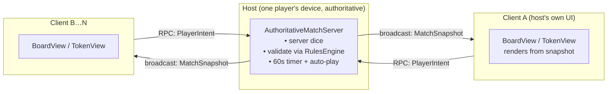

# Phase 3 — Online Multiplayer (Photon Fusion 2)

> Status: **server core done & tested (16/16)**. Photon transport adapter is the next step — it needs the Fusion 2 SDK imported into the Unity project first.

## What's already built (and unit-tested in .NET)

All transport-agnostic, in `src/Ludo.Core/Net/`:

| Piece | Role |
|---|---|
| **`PlayerIntent`** | client→server message: `Roll(seat)` or `Move(seat, tokenId)` |
| **`MatchSnapshot`** | server→client compact binary state (seats, token progress, current seat, dice, movable tokens, finish order). `Serialize()` / `Deserialize()` |
| **`AuthoritativeMatchServer`** | the **host's brain**: rolls the dice (server-side), validates every intent via `RulesEngine`, runs the 60 s turn timer + auto-play, raises `OnSnapshot` after each change |

The server is **the same code path for bots, humans, and timeouts** — bots and AFK humans are auto-played by the server; real players submit intents. Nothing about it depends on Unity or Photon.

## Architecture

- **Host mode** (one player hosts; cheapest for a turn-based game; no dedicated servers to pay for). Can later be swapped for a dedicated server build with zero gameplay changes.
- Clients **render by diffing snapshots** — a token whose progress changed → animate the hop; a token that jumped to base → animate the kick-off. (Re-uses the existing `BoardView`/`TokenView`.)
- Because it's turn-based, traffic is tiny (a snapshot per action), so 150–300 ms latency is invisible.

## The Fusion adapter (next step — written once the SDK is imported)

One `NetworkBehaviour`, e.g. `LudoNetSession`:
- **Host** creates the `AuthoritativeMatchServer`, calls `Tick()` in `FixedUpdateNetwork()`, and on `OnSnapshot` broadcasts the bytes (`[Networked]` capacity buffer or a reliable RPC).
- **Clients** send `RPC_SubmitIntent(type, seat, tokenId)` → host calls `server.Submit(...)`.
- **Clients** receive the snapshot → deserialize → update a local `MatchState` mirror → drive `BoardView`.
- Lobby: `NetworkRunner.StartGame(GameMode.Host/Client, sessionName: roomCode)`.

Mapping is 1:1 with what's already built, so the adapter is thin.

## Setup — import Photon Fusion 2 (your step; ~2 min)

The adapter scaffold is already in the repo at `client/Assets/Scripts/Net/LudoNetSession.cs`, **gated on the
`FUSION2` define** — it's inert (build stays green) until you import Fusion, then it activates.

**Acquire + import the SDK** (pick one):

- **Asset Store (free):**
  1. On the web, go to **assetstore.unity.com**, search **"Photon Fusion 2"** (publisher *Exit Games*) → **Add to My Assets** (sign in with your Unity ID).
  2. In Unity: **Window ▸ Package Manager** → top-left dropdown → **Packages: My Assets** → find **Photon Fusion 2** → **Download** → **Import** → *Import* everything.
- **Or Photon dashboard:** at **dashboard.photonengine.com**, open your Fusion app → download the SDK `.unitypackage` → in Unity **Assets ▸ Import Package ▸ Custom Package…** → import.

**After import:**
3. The **Fusion Hub / Wizard** opens → paste your **Fusion App Id** (from `config/ludo.config.json → services.photon.fusionAppId`) into the *App Id Fusion* field. This creates the Photon App Settings asset.
4. Fusion adds the `FUSION2` scripting define automatically → the adapter compiles.
5. Tell me **"Fusion imported"** — I'll finalize the bits that need the Editor: a NetworkObject prefab for `LudoNetSession`, register it in the NetworkProjectConfig, wire `LudoNetBootstrap`, and connect snapshots to the existing board renderer. Then we test two instances.

> Tip: if you don't want to drive the web step, I can guide you click-by-click in teach mode — just ask.

## How we'll test two players (no second device needed)

Pick one:
- **ParrelSync** (free) — clones the project so you can run **two Editors** (one Host, one Client) side by side. Easiest.
- **Build + Editor** — make a desktop build, run it as Host, and Join from the Editor (or vice-versa).
- **Two desktop builds** on the same machine.

Flow: Host creates a room (gets a code) → Client joins with the code → both see the same board → take turns.

## When you're ready

Import Fusion 2 + paste the App ID, then tell me — I'll write `LudoNetSession` (+ a small lobby UI) against the real SDK and we'll iterate via the Console, exactly like we did for the modules fix.
